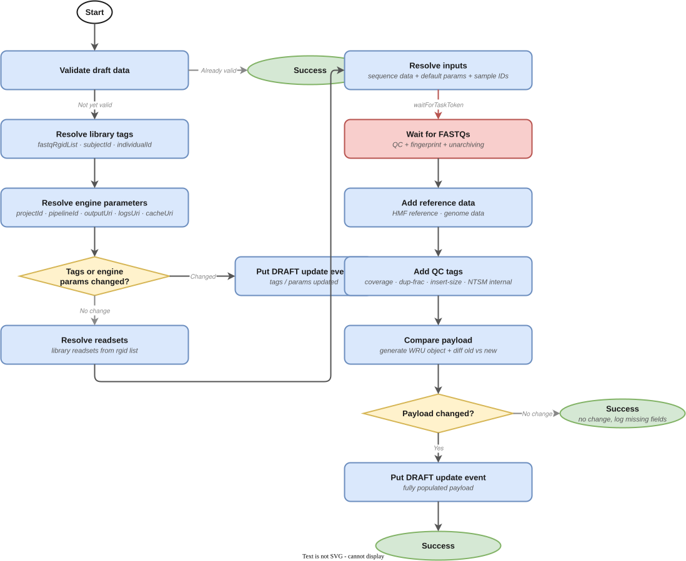
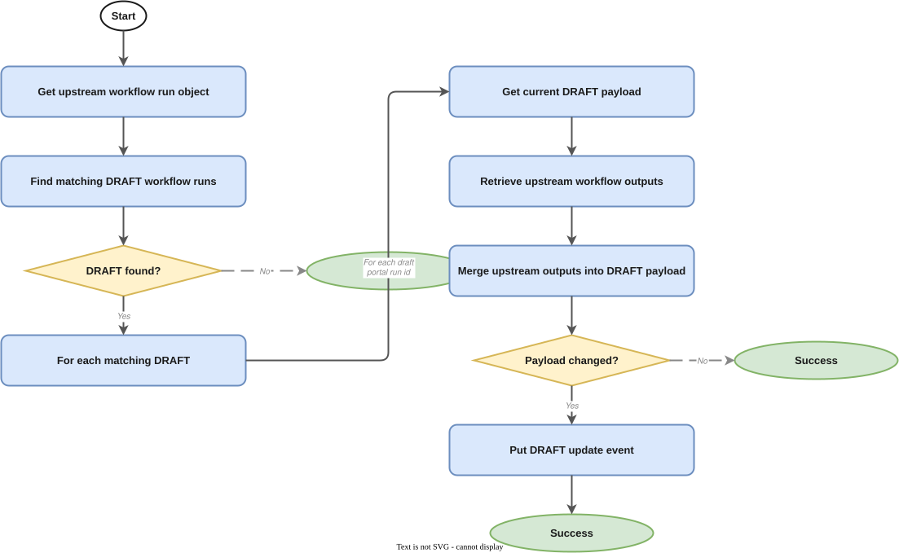

# Oncoanalyser WGTS RNA Pipeline Manager

- [Overview](#overview)
- [Pipeline State Flow](#pipeline-state-flow)
  - [1. DRAFT → populated DRAFT](#1-draft--populated-draft)
  - [2. Populated DRAFT → READY](#2-populated-draft--ready)
  - [3. READY → ICAv2 submission](#3-ready--icav2-submission)
  - [4. ICAv2 state changes → WorkflowRunUpdate events](#4-icav2-state-changes--workflowrunupdate-events)
  - [5. Upstream SUCCEEDED → DRAFT update (glue)](#5-upstream-succeeded--draft-update-glue)
- [Event Contract](#event-contract)
  - [Consumed Events](#consumed-events)
  - [Published Events](#published-events)
- [Draft Event Payload](#draft-event-payload)
  - [Minimal DRAFT event detail](#minimal-draft-event-detail)
  - [Auto-populated Fields](#auto-populated-fields)
  - [Schema Validation](#schema-validation)
- [Submitting a Draft Event](#submitting-a-draft-event)
- [Infrastructure](#infrastructure)
  - [Stateful Resources](#stateful-resources)
  - [Stateless Resources](#stateless-resources)
  - [Stacks](#stacks)
- [CI/CD and Release Management](#cicd-and-release-management)
- [Related Services](#related-services)
- [SOPs](#sops)
- [Glossary & References](#glossary--references)

---

## Overview

This service manages the lifecycle of the **Oncoanalyser WGTS RNA pipeline** — a somatic RNA analysis pipeline that performs RNA-based variant calling, gene expression analysis, and fusion detection using the Oncoanalyser toolchain (ISOFOX) on ICAv2.

The pipeline runs on [ICAv2](https://www.illumina.com/products/by-type/informatics-products/connected-analytics.html) via CWL/Nextflow. See the [CWL releases](https://github.com/umccr/cwl-ica/releases?q=oncoanalyser-wgts-rna&expanded=true) for versioned workflow definitions. Orchestration follows the standard [ICAv2-centric Pipeline Architecture](https://github.com/OrcaBus/wiki/blob/main/orcabus-platform/README.md#pipeline-orchestration-general-logic).

This is a **downstream** service — it depends on the successful completion of the Dragen WGTS DNA pipeline (via a glue state machine) to obtain alignment BAM outputs as inputs.

**Upstream**: [Dragen WGTS DNA](https://github.com/OrcaBus/service-dragen-wgts-dna-pipeline-manager)
**Downstream**: [Oncoanalyser WGTS Both](https://github.com/OrcaBus/service-oncoanalyser-wgts-both-pipeline-manager), [RNAsum](https://github.com/OrcaBus/service-rnasum-pipeline-manager)

---

## Pipeline State Flow

The service orchestrates five Step Functions state machines that together drive a workflow run from initial DRAFT submission through to ICAv2 execution and result reporting.

### 1. DRAFT → populated DRAFT

**State machine**: [`populate_draft_data_sfn_template`](app/step-functions-templates/populate_draft_data_sfn_template.asl.json)



When a `WorkflowRunStateChange` DRAFT event arrives, this state machine populates any missing payload fields by resolving defaults from SSM and querying upstream services:

1. **Early exit check** — validates whether the existing `data` payload already satisfies the complete-data schema. If it does, no further population is needed and the state machine exits.
2. **Resolve engine parameters** (in parallel):
   - `projectId` — uses the provided value or fetches the environment default from SSM
   - `pipelineId` — uses the provided value, the event's `executionEnginePipelineId`, or looks up the default for the workflow version from SSM
   - `outputUri` — uses the provided value or builds a path from the SSM output prefix + `portalRunId`
   - `logsUri` — same pattern as `outputUri`
3. **Resolve tags** — determines `libraryId`, `subjectId`, `individualId`, `fastqRgidList` from linked libraries and upstream metadata.
4. **Emit a DRAFT update event** if tags or engine parameters changed (so the Workflow Manager record is kept in sync), then continue.
5. **Resolve inputs** — resolves FASTQ list rows, genome references, and HMF data paths. May convert BAM inputs to FASTQ via ECS tasks when required.
6. **Final comparison** — invokes `comparePayload` to check if anything changed. If changed, emits a final DRAFT update event. If unchanged, generates a comment listing missing fields.

### 2. Populated DRAFT → READY

**State machine**: [`validate_draft_data_and_put_ready_event_sfn_template`](app/step-functions-templates/validate_draft_data_and_put_ready_event_sfn_template.asl.json)


Triggered when a DRAFT `WorkflowRunStateChange` event is received with a fully populated payload:

1. **Schema validation** — invokes the `validate_draft_complete_schema` Lambda against the registered AWS Schemas registry entry. On failure, a comment is written back to the workflow run record and the state machine exits silently.
2. **Post-schema validation** — invokes the `post_schema_validation` Lambda for business-rule checks (engine parameters, URI validation, input accessibility). On failure, same comment-and-exit behaviour.
3. **Push READY event** — emits a `WorkflowRunStateChange` READY event to the `OrcaBusMain` EventBridge bus.

### 3. READY → ICAv2 submission

**State machine**: [`ready_event_to_icav2_wes_request_event_sfn_template`](app/step-functions-templates/ready_event_to_icav2_wes_request_event_sfn_template.asl.json)


Converts a READY event into an `Icav2WesRequest` event that the [ICAv2 WES Manager](https://github.com/OrcaBus/service-icav2-wes-manager) consumes to launch the analysis on ICAv2:

1. **Convert** — the `convert_ready_event_inputs_to_icav2_wes_event_inputs` Lambda translates the READY event payload into the ICAv2 WES request format.
2. **Push** — emits an `Icav2WesRequest` event to `OrcaBusMain`.

### 4. ICAv2 state changes → WorkflowRunUpdate events

**State machine**: [`icav2_wes_asc_event_to_workflow_rsc_event_sfn_template`](app/step-functions-templates/icav2_wes_asc_event_to_workflow_rsc_event_sfn_template.asl.json)


Listens for `Icav2WesAnalysisStateChange` events and converts them into `WorkflowRunUpdate` events:

1. **Convert** — the `convert_icav2_wes_event_to_wrsc_event` Lambda maps the ICAv2 status to a `WorkflowRunStateChange` event.
2. **Route by status**:
   - **SUCCEEDED** — collects Oncoanalyser RNA outputs (ISOFOX results), then pushes the WRSC event.
   - **FAILED** — writes a failure comment to the workflow run record, then pushes the WRSC event.
   - **Any other status** — pushes the WRSC event directly.

### 5. Upstream SUCCEEDED → DRAFT update (glue)

**State machine**: [`glue_succeeded_events_to_draft_update_sfn_template`](app/step-functions-templates/glue_succeeded_events_to_draft_update_sfn_template.asl.json)



Reacts to upstream Dragen WGTS DNA `SUCCEEDED` events and updates existing DRAFT runs with new alignment data:

1. **Receive** upstream SUCCEEDED event (portalRunId, libraries, workflow info).
2. **Find matching DRAFTs** — calls `findLatestWorkflow` with `status=DRAFT` for `oncoanalyser-wgts-rna` to find existing DRAFT runs matching the same libraries.
3. **For each DRAFT** — fetches the DRAFT payload, gets upstream BAM outputs, merges them into the DRAFT payload, compares old vs new, and emits a WorkflowRunUpdate DRAFT event if changed.
4. **No DRAFTs found** — exits silently (the glue event arrived before the DRAFT was created).

---

## Event Contract

### Consumed Events

| DetailType | Source | Schema | Description |
|---|---|---|---|
| `WorkflowRunStateChange` | `orcabus.workflowmanager` | [WorkflowRunStateChange](https://github.com/OrcaBus/wiki/tree/main/orcabus-platform#workflowrunstatechange) | Carries DRAFT (and later READY) workflow run records |
| `Icav2WesAnalysisStateChange` | `orcabus.icav2wes` | [Icav2WesAnalysisStateChange](https://github.com/OrcaBus/service-icav2-wes-manager/blob/main/app/event-schemas/analysis-state-change.json) | ICAv2 analysis state updates |

### Published Events

| DetailType | Source | Schema | Description |
|---|---|---|---|
| `WorkflowRunUpdate` | `orcabus.oncoanalyserwgtsrna` | [WorkflowRunUpdate](https://github.com/OrcaBus/wiki/blob/main/orcabus/platform/events.md#workflowrunupdate) | Pipeline state updates (DRAFT, READY, running, succeeded…) |

---

## Draft Event Payload

A DRAFT event can be submitted with a minimal `data` payload — the populate state machine resolves all defaults. The `data` object may be omitted entirely. The final validated payload must satisfy the [complete-data draft schema](app/event-schemas/complete-data-draft/).

### Minimal DRAFT event detail

```json
{
  "status": "DRAFT",
  "workflowName": "oncoanalyser-wgts-rna",
  "workflowVersion": "2.1.0",
  "workflowRunName": "umccr--automated--oncoanalyser-wgts-rna--2-1-0--<portalRunId>",
  "portalRunId": "<portalRunId>",
  "linkedLibraries": [
    { "libraryId": "L2500568", "orcabusId": "lib.01..." }
  ]
}
```

The `payload.data` object may be included to override any auto-populated fields. An empty or absent `payload.data` is valid.

### Auto-populated Fields

All of the following are resolved by the populate state machine if not explicitly provided:

| Field | Resolved from |
|---|---|
| `engineParameters.projectId` | SSM: default ICAv2 project for the environment |
| `engineParameters.pipelineId` | SSM: pipeline ID map keyed by workflow version |
| `engineParameters.outputUri` | SSM: output prefix + `portalRunId` |
| `engineParameters.logsUri` | SSM: logs prefix + `portalRunId` |
| `tags.libraryId` | From `linkedLibraries` |
| `tags.subjectId` / `individualId` | Metadata service |
| `tags.fastqRgidList` | Fastq Glue — resolved from `libraryId` |
| `inputs.fastqListRows` | Fastq Glue — FASTQ list rows for the RNA library |
| `inputs.genome` / reference paths | SSM: default references for workflow version |

### Schema Validation

The complete-data schema is registered in the AWS Schemas registry and used for validation. You can interactively validate a payload at:

- [JSON Schema Validator](https://www.jsonschemavalidator.net/) (paste the schema from `app/event-schemas/complete-data-draft/`)

---

## Submitting a Draft Event

To manually submit an Oncoanalyser WGTS RNA DRAFT event (e.g. to trigger a reanalysis), follow:

- [PM.OWR.1 — Manual Pipeline Execution](docs/operation/SOP/PM.OWR.1/PM.OWR.1-ManualPipelineExecution.md)

See the [full SOPs index](docs/operation/SOP/README.md) for all operational procedures including deployment, parameter updates, and troubleshooting.

---

## Infrastructure

The service is deployed via AWS CDK. Resources are split into two stacks: stateful (data/config) and stateless (compute/events).

All SSM parameters live under `/orcabus/workflows/oncoanalyser-wgts-rna/`.
Event bus: `OrcaBusMain`
Event source: `orcabus.oncoanalyserwgtsrna`

### Stateful Resources

**AWS Schemas registry**
- `oncoanalyser-wgts-rna-complete-data-draft-schema.json` — used to validate DRAFT payloads before promotion to READY

**SSM Parameters**

| Parameter | Description |
|---|---|
| `workflowName` | `oncoanalyser-wgts-rna` |
| `workflowVersion` | Current default version (e.g. `2.1.0`) |
| `payloadVersion` | Payload schema version |
| `icav2ProjectId` | Default ICAv2 project ID per environment |
| `logsPrefix` | Default S3 prefix for logs |
| `outputPrefix` | Default S3 prefix for outputs |
| `pipelineIdsByWorkflowVersion/<version>` | ICAv2 pipeline ID for each workflow version |
| `inputsByWorkflowVersion/<version>` | Default inputs JSON |

### Stateless Resources

- **Lambda functions** (Python 3.14, ARM64) — one per task in the state machines; see [`app/lambdas/`](app/lambdas/)
- **ECS tasks** — BAM-to-FASTQ conversion and FASTQ list row generation; see [`app/ecs/`](app/ecs/)
- **Step Functions state machines** — five ASL templates in [`app/step-functions-templates/`](app/step-functions-templates/)
- **EventBridge rules** — route incoming `WorkflowRunStateChange` (DRAFT/READY), `Icav2WesAnalysisStateChange`, and upstream SUCCEEDED events to the appropriate state machines

### Stacks

The CDK project deploys a CodePipeline in the toolchain account that promotes changes to `beta`, `gamma`, and `prod`.

```sh
# List stateful stacks
pnpm cdk-stateful ls

# List stateless stacks
pnpm cdk-stateless ls
```

---

## CI/CD and Release Management

All changes merged to `main` are automatically built and deployed to `beta` and `gamma`. Promotion to `prod` requires manually enabling the CodePipeline transition in the AWS console.

---

## Related Services

| Role | Service |
|---|---|
| Upstream | [Dragen WGTS DNA](https://github.com/OrcaBus/service-dragen-wgts-dna-pipeline-manager) |
| Downstream | [Oncoanalyser WGTS Both](https://github.com/OrcaBus/service-oncoanalyser-wgts-both-pipeline-manager) |
| Downstream | [RNAsum](https://github.com/OrcaBus/service-rnasum-pipeline-manager) |
| ICAv2 execution | [ICAv2 WES Manager](https://github.com/OrcaBus/service-icav2-wes-manager) |
| Workflow state | [Workflow Manager](https://github.com/OrcaBus/service-workflow-manager) |

---

## SOPs

| SOP | Description |
|---|---|
| [PM.OWR.1](docs/operation/SOP/PM.OWR.1/PM.OWR.1-ManualPipelineExecution.md) | Manually kick off a reanalysis |
| [PM.OWR.2](docs/operation/SOP/PM.OWR.2/PM.OWR.2-NewPipelineDeployment.md) | Install and deploy a new pipeline version |
| [PM.OWR.3](docs/operation/SOP/PM.OWR.3/PM.OWR.3-UpdatingPipelineParameters.md) | Update SSM parameters |
| [PM.OWR.4](docs/operation/SOP/PM.OWR.4/PM.OWR.4-RunningWorkflowValidations.md) | Run workflow validations |
| [PM.OWR.5](docs/operation/SOP/PM.OWR.5/PM.OWR.5-TroubleShooting.md) | Troubleshoot common issues |

---

## Glossary & References

- Platform glossary: [OrcaBus wiki](https://github.com/OrcaBus/wiki/blob/main/orcabus-platform/README.md#glossary--references)
- For development setup, build commands, project structure, and conventions see the [steering docs](.kiro/steering/).
